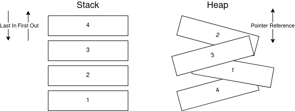

Salah satu fitur utama dalam Rust yaitu Ownership dan Borrowing, konsep ini sangat erat dengan kerja nilai yang disimpan dengan memori.

## Penanganan Memori 101
Sebelum kita membahas lebih lanjut, kita perlu tahu secara bagaimana nilai disimpan pada memori. Dalam memori sendiri tedapat 2 cara penyimpanan: **stack** dan **heap**.



### Stack
Stack bila diartikan: tumpukan, maka pada memori mengatur data tersimpan bertumpuk dan terurut, dengan pendekatan LIFO(_Last In,First Out_) untuk melakukan akses data. 

Cara ini lebih cepat untuk mengakses data karena terurut. Stack pada Rust digunakan pada data yang diketahui ukuranya, seperti literal / bersifat statis tidak bertambah ukuranya.

### Heap
Heap serupa dengan tumpukan namun terdapat perbedaan, Heap tidak terurut seperti Stack namun biaya akses lama karena harus mencari berdasarkan alamat dalam memori. Heap menyimpan data yang ukuranya tidak diketahui dan terus bertambah, seperti vector.

Pada dasarnya Heap dan Stack memiliki alamat, namun stack hanya perlu memori untuk tumpukan teratas sisa dilanjutkan dengan pendekatan LIFO sedangkan Heap perlu mengetahui semua alamat isinya.

Proses saat menyematkan nilai pada memori disebut alokasi dan pelepasan nilai menjadi tidak dipakai disebut dealokasi.

## Ownership (Kepemilikan)

Sebelumnya sempat dibahas mengenai satu nilai hanya memiliki satu alamat meskipun nilai tersebut berada di variable yang berbeda.

Kepemilikan dapat disimpulkan keterikatan suatu nilai pada dengan suatu variable. Prinsip kepemilikan Rust mengikut aturan berikut:

- Nilai hanya memiliki satu pemilik
- Ketika pemilik nilai tidak berada pada cakupan lokal yang sama maka nilai akan dihapus (dibebaskan dari memori).

Stack dan Heap memiliki sifat yang berbeda dalam kepemilikan. Karena stack ukuranya diketahui secara langsung maka dia akan memiliki alamat yang tetap, meskipun berbeda variable namun memiliki nilai yang sama variable tersebut akan memiliki alamat yang sama. Ini disebut sebagai konsep [RAII (_Resource Accusition is Intialization_)](https://en.wikipedia.org/wiki/Resource_acquisition_is_initialization).

- Alokasi dengan Stack (literal string "Pita")
```rust
fn main(){
    let nama_depan = "Pita";
    let nama_belakang = "Pita";
    println!("alamat nama_depan : {}",nama_depan.as_ptr());
    println!("alamat nama_belakang : {}",nama_belakang.as_ptr());
    println!("apakah alamat sama ? {}",
        if nama_depan.as_ptr() == nama_belakang.as_ptr(){
            "Sama"
        }else{
            "Enga sama"
        }
    )
}
```

- Alokasi dengan Stack (string "Pita")
```rust
fn main(){
    println!("[Heap Variable]");
    let nama_depan = String::from("Pita");
    let nama_belakang = String::from("Pita");
    println!("alamat nama_depan : {:?}",nama_depan.as_ptr());
    println!("alamat nama_belakang : {:?}",nama_belakang.as_ptr());
    println!("apakah alamat sama ? {}",
        if nama_depan.as_ptr() == nama_belakang.as_ptr(){
            "Sama"
        }else{
            "Enga sama"
        }
    )
}
```

#### Moved , Copy dan Drop

Ketiga istilah diatas merupakan proses kerja transfer kepemilikan pada nilai yang disimpan pada Heap. Heap menyimpan nilai didalam memori secara tidak terurut yang artinya perlu mencari alamat keseluruh memori sampai ketemu, hal ini juga yang membuat data yang disimpan pada heap bisa bertambal (_Growable_).

[WIP]